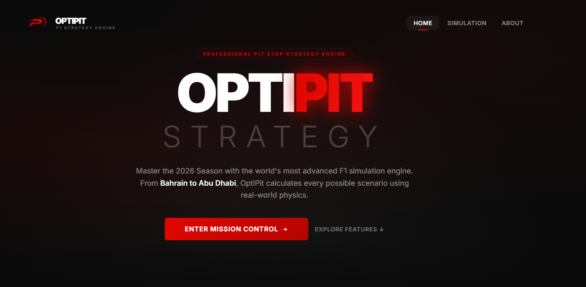
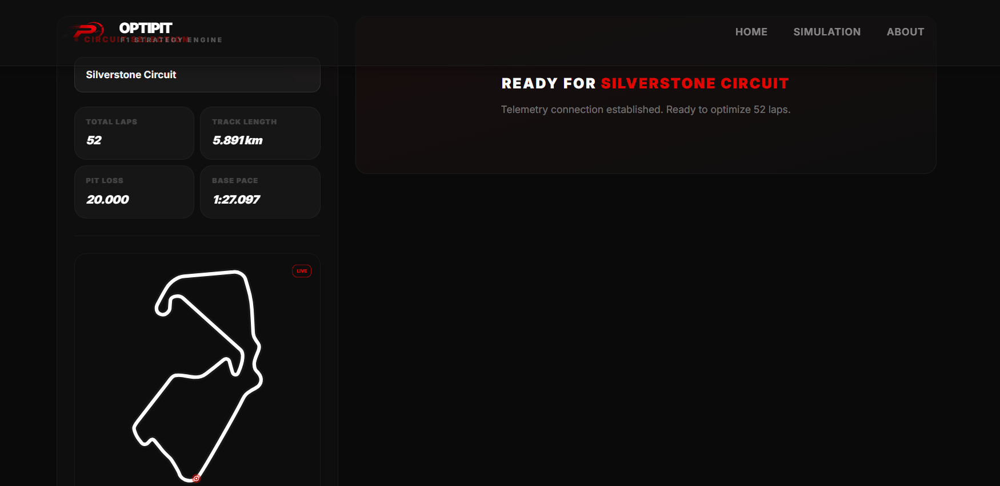
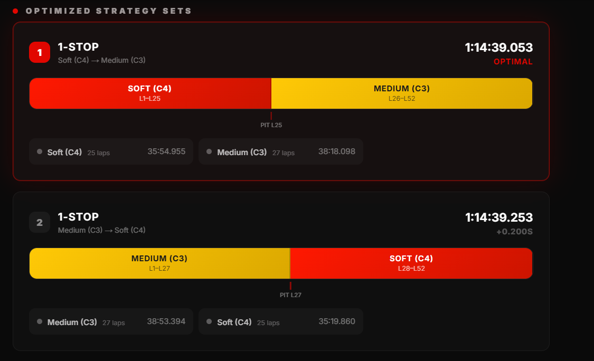
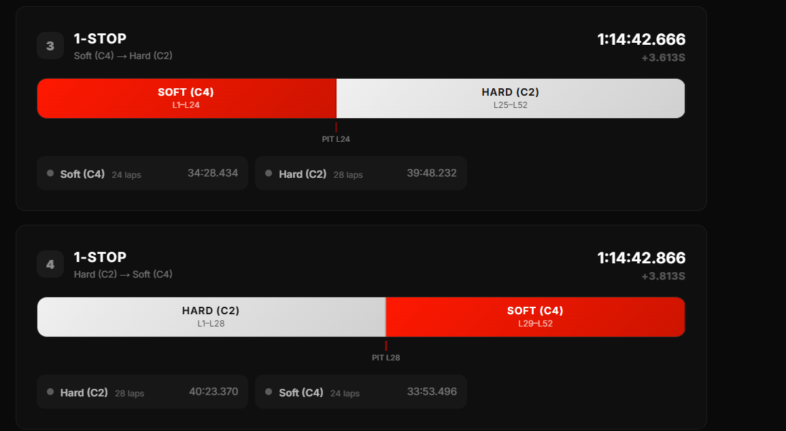
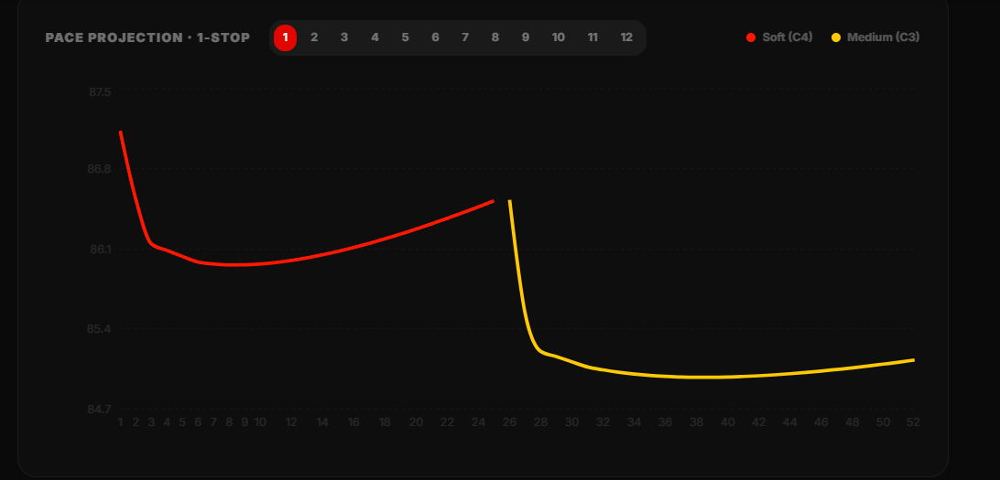
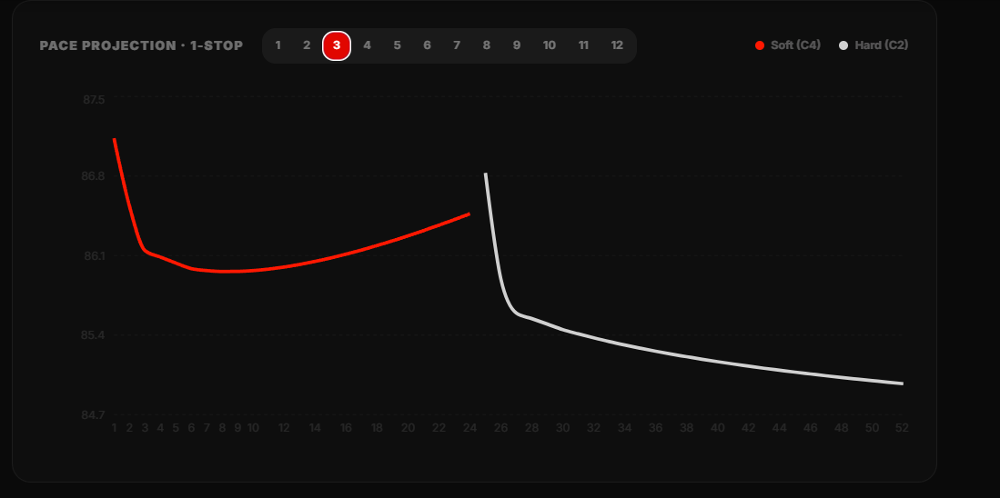
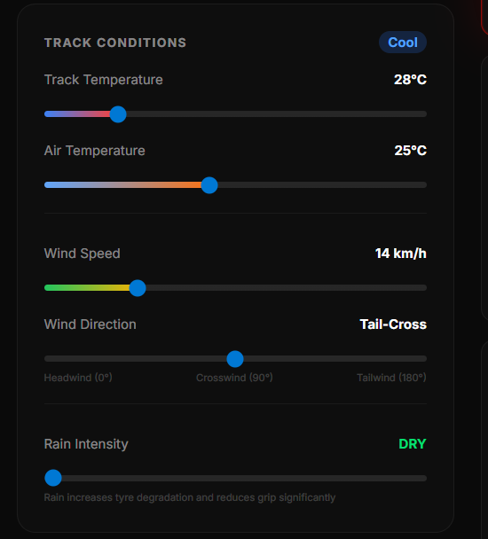

# F1 Real-Time Race Strategy Simulator

> **"Strategy is everything. You can have the fastest car, but if you're on the wrong tyres at the wrong time, you're just a spectator."**

---

## Driven by a Passion for Formula 1 (The Human Perspective)

If you've found your way here, you probably know the adrenaline rush when the five red lights go out. As a die-hard Formula 1 fan, I realized early on that the spectacle doesn't end at the first corner. The real battle happens at the "pit wall," among the engineers calculating every millisecond and managing the degradation of every single set of tyres.

This project was born from a desire to put the same tools used by giants like Red Bull or Mercedes into anyone's hands. I wanted to create a space where strategy isn't just a buzzword, but a living algorithm reacting to rain, wind, and temperature. This is my tribute to the sport that keeps us on the edge of our seats every race weekend.

**Box, box, box!** It's time to decide: do you risk an _undercut_ or go for the _long stint_?

## Key Features

1.  **Multi-Variable Simulation**: Considers track temperature, wind speed/angle, rain intensity, and track grip evolution.
2.  **Real-Time Optimization**: Automatically calculates the fastest pit-stop combinations.
3.  **Tyre Management**: Models the behavior of Hard, Medium, and Soft compounds, including wet-weather tyres (Inter & Wet).
4.  **Live Telemetry**: Visualize lap times and pit-stop windows through interactive charts.

---

## Academic & Technical Foundation

From an academic perspective, the **F1 Race Strategy Simulator** is a complex implementation of real-time distributed systems and applied mathematical modeling. The project explores the intersection of data analytics and modern software engineering.

### Technology Stack

#### Backend: Java & Spring Boot

I chose **Java** as the primary language for its strong typing and high performance in data-intensive processing.

- **Spring Boot**: Provides a robust ecosystem for service and dependency management.
- **WebSockets (STOMP)**: Essential for real-time simulation. It enables efficient bi-directional communication, pushing telemetry and strategy updates to the client without the need for constant polling.

#### Frontend: Next.js & React

The interface is designed to provide a fluid and informative user experience:

- **Next.js (App Router)**: For a modular structure and optimized performance.
- **Recharts**: Visualizing telemetry data and degradation curves, turning raw numbers into easily digestible visual information.
- **Tailwind CSS & Shadcn/UI**: For a modern, premium design that mirrors professional motorsport interfaces.

---

## The Simulation Model: Metrics & Variables

The core logic behind every lap time is a multi-dimensional simulation model. Here is the breakdown of the metrics that influence the race strategy:

### 1. Environmental & Weather Factors

- **Track Temperature**: The simulation uses a nominal baseline of **35°C**. Temperatures above this threshold accelerate thermal degradation, while lower temperatures can make it harder to maintain tyre surface heat.
- **Air Temperature & Cooling**: Air temp affects engine efficiency and aero density (0.025s sensitivity). It also influences the **Dynamic Cooling** of the tyres; cooler air helps prevent the tyres from reaching the "thermal cliff."
- **Wind Dynamics**: We model aerodynamic drag using a **0.015 drag coefficient**. The system calculates the `effectiveHeadwind` using the cosine of the wind angle relative to the main straight, resulting in a direct penalty or bonus to lap time.
- **Rain & Precipitation**:
  - Increases lap times by up to **4.0s** (base penalty).
  - Drastically reduces the track evolution bonus.
  - Increases the probability of **Safety Car** or **VSC** events.
  - Wet tyres on a dry track suffer a significant "dry penalty" due to overheating.

### 2. Tyre Physics & Compound Dynamics

- **Non-Linear Degradation**: Unlike a linear wear model, our tyres follow a power-law curve.
  - **Initial Phase (Laps 1-6)**: Slow, predictable wear.
  - **The Cliff (Lap 22+ saturation)**: A non-linear performance drop modeled as `pow(lap, 2.0) / (1 + lap / 22.0)`.
- **Tyre Warmup**: Every pit stop introduces a **Warmup Penalty** (base 0.5s) that decays over the first two laps of a stint as the surface temperature reaches the optimal **90°C** window.
- **Driving Modes**:
  - **PUSH**: +2% pace, but +80% degradation increase.
  - **CONSERVATIVE**: -5% pace, but reduced wear and lower thermal stress.

### 3. Car & Circuit Characteristics

- **Fuel Weight (The "Light Car" Effect)**: The car consumes **1.75kg** of fuel per lap. Every kg lost improves the lap time by **0.03s**, meaning the car is significantly faster at the end of the race than at the start.
- **Track Evolution (Rubbering-in)**: As cars circulate, they lay down rubber. This is modeled as an **Exponential Saturation** function, reaching a maximum bonus of **0.15s** towards the end of the race.
- **Circuit DNA**: Each circuit has unique coefficients for:
  - **Asphalt Abrasion**: Affects base wear.
  - **Tyre Stress**: Affects thermal sensitivity.
  - **Lateral Forces**: Affects degradation in high-speed corners.

---

## The Algorithms Behind the Magic

To provide an authentic experience, the simulator relies on two core engines: the **Lap Time Simulation Engine** and the **Strategy Optimization Engine**.

### 1. Lap Time Simulation (Non-Linear Physics)

Unlike simple simulators that use linear degradation, our `SimulationService` implements a complex, non-linear model:

- **The "Tyre Cliff"**: Degradation follows a power-law model after an initial linear phase. Once the tyres reach the "cliff" (typically after 20-25 laps), performance drops exponentially.
- **Fuel Corrected Pace**: The car gets faster as it burns 1.75kg of fuel per lap, reducing weight and improving cornering speeds by ~0.03s per kg.
- **Track Evolution**: As the race progresses, the track "rubbers in," providing more grip. This is modeled using an exponential saturation function.
- **Climatic Impact**:
  - **Wind**: A headwind on the main straight increases drag, while a tailwind reduces it.
  - **Temperature**: High track temperatures accelerate thermal degradation, while air temperature affects engine cooling and aero density.
  - **Rain**: A dynamic grip multiplier that shifts the advantage from slicks to Intermediates or Wets based on precipitation intensity.

### 2. Strategy Optimization (Search & Pre-computation)

The `StrategyOptimizer` solves the "optimal pit-stop" problem, which is essentially finding the shortest path through a weighted directed acyclic graph (DAG) of stints.

- **The Pre-computation Heuristic**: Calculating lap times on-the-fly is expensive. The engine uses a 3D matrix (Compound x Start Lap x Duration) to store every possible stint time. This is a form of **Memoization** that allows the optimizer to "see" the future cost of a tyre choice instantly.
- **Coarse-to-Fine Search (Pruning)**:
  - For a 60-lap race, a 3-stop strategy has $\approx 34,220$ possible pit lap combinations _per compound set_.
  - The algorithm first uses **Coarse Sampling** (step of 3 laps) to reduce the search space by ~96%.
  - It identifies the **Top-K Promising Branches** and then performs a **Local Gradient Search** (step of 1 lap) in a $\pm 4$ lap window around each coarse peak. This heuristic assumes that the global optimum in a continuous-like performance space is rarely far from a coarse local optimum.
- **Multi-Compound Heuristics**: The search space is pruned by enforcing FIA-style rules (e.g., using at least two different compounds) and weather-based filtering (e.g., ignoring slicks when rain intensity exceeds 0.5).
- **Environmental Bias**: The optimizer adds "Traffic Loss" and "Pit Lane Loss" as constant penalties, which acts as a natural heuristic to prevent the algorithm from choosing high-frequency stops unless the tyre degradation is extreme.

---

## Showcase

  <table>
    <tr>
      <td></td>
      <td></td>
    </tr>
    <tr>
      <td></td>
      <td></td>
    </tr>
    <tr>
      <td></td>
      <td></td>
    </tr>
    <tr>
      <td colspan="2" align="center"></td>
    </tr>
  </table>

---

## Installation & Setup

### Backend

1. Navigate to the `/backend` folder.
2. Run `./gradlew.bat bootRun` to start the server.

### Frontend

1. Navigate to the `/frontend` folder.
2. Run `npm install` and then `npm run dev`.
3. Access the app at `http://localhost:3000`.

---

> _"In F1, data is the new currency. This simulator is your wallet."_

---

### Disclaimer

This project is a **fan-made simulation** and is **not** affiliated, associated, authorized, endorsed by, or in any way officially connected with Formula 1, the FIA, Pirelli or any of their subsidiaries or affiliates. The names Formula 1, F1, as well as related names, marks, emblems, and images, are registered trademarks of their respective owners. This tool is for educational and entertainment purposes only.
